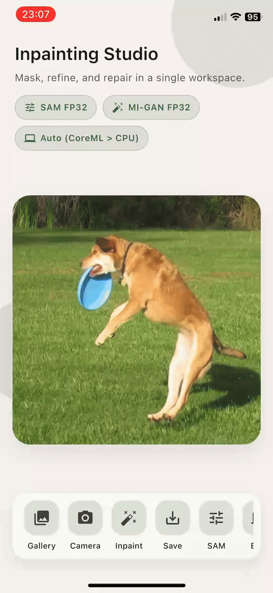

# Inpainting App

A Flutter-based mobile application for object removal from images using on-device deep learning models.  
The app provides a simple interactive workflow: select an image, draw a mask, and let the inpainting model reconstruct the missing region. All processing runs locally on the device using ONNX Runtime.

## Features

- **Image selection**  
  Choose images from the gallery or local filesystem or take a photo.

- **Automatic segmentation with MobileSAM (ONNX)**  
  Tap on the image or draw circle over the object to generate segmentation masks using MobileSAM, enabling object-aware removal workflows.

- **On-device inpainting with MI-GAN (ONNX)**  
  The MI-GAN model performs high-quality inpainting with no internet connection required.

- **Developer-friendly logging**  
  Logs inference times, model events, failures, and internal states to help with debugging and performance profiling.

## Demo

## Tech Stack

- **Flutter / Dart** – cross-platform UI
- **onnxruntime_flutter** – optimized on-device ONNX inference
- **MI-GAN ONNX** – generative inpainting model
- **MobileSAM ONNX** – lightweight segmentation model for point-based prompting
- Target platforms: **Android** and **iOS**

## Project Structure (short)

- `lib/app.dart` – global app configuration (theme, navigation)
- `lib/main.dart` – app entry point
- `lib/inpainting_page.dart` – complete inpainting workflow UI
- `lib/mask_painter.dart` – canvas overlay for mask drawing
- `lib/image_service.dart` – image loading, resizing, saving
- `lib/inpainting_service.dart` – MI-GAN inference logic
- `lib/segmentation_service.dart` – MobileSAM encoder/decoder inference
- `lib/image_utils.dart`, `lib/tensor_utils.dart` – utilities for converting images to tensors and back
- `lib/app_logger.dart` – structured logging for debugging and performance metrics

## Overview

The app is designed as a modular foundation for experimenting with mobile inpainting workflows.  
By combining segmentation (MobileSAM) with generative inpainting (MI-GAN), the application aims to support advanced object-removal use cases entirely offline. The architecture allows for easy extension — such as integrating new models or benchmarking models.

