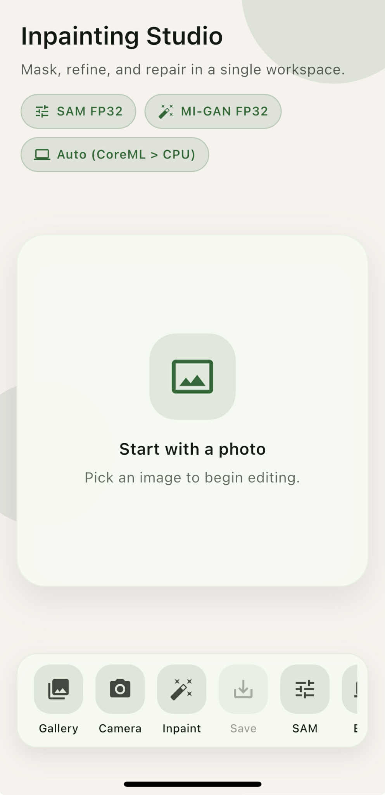
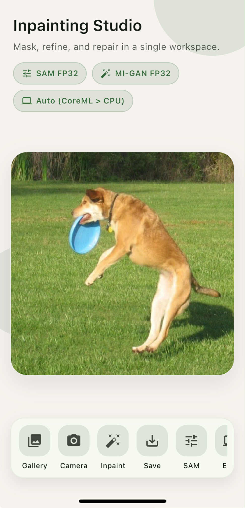
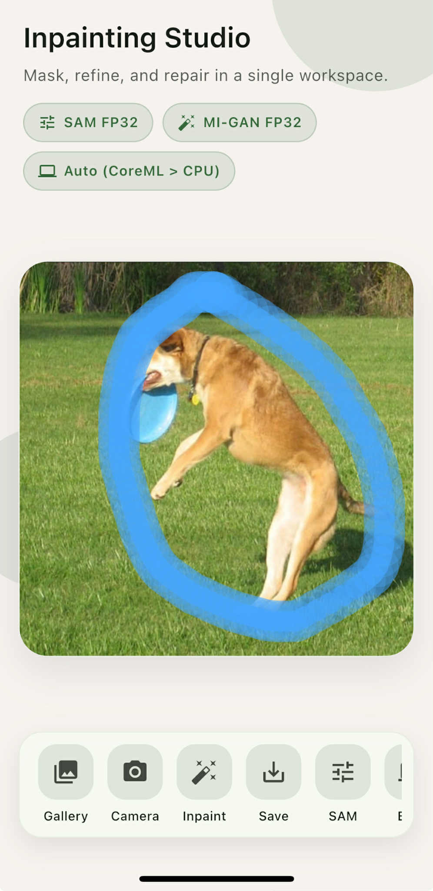
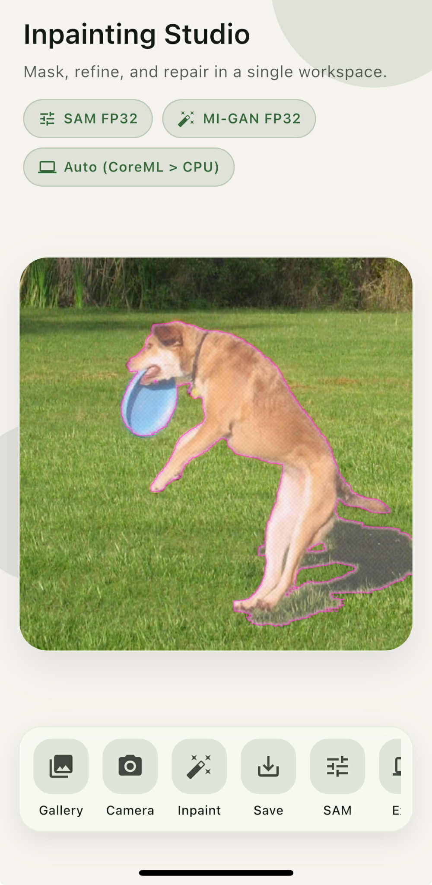
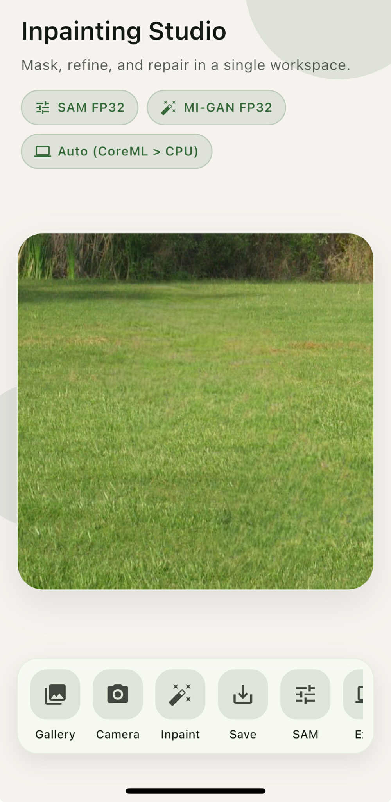

# Inpainting-App

Inpainting-App is a cross-platform Flutter application for offline object removal from images. The system performs on-device inference using ONNX Runtime and combines interactive segmentation with deep learning–based image inpainting.

The application was developed as part of an engineering thesis focused on mobile object removal and visual artifact handling (e.g. shadows and reflections), without relying on cloud services or external APIs.

## Architectural Overview

The application is designed as a modular foundation for experimenting
with mobile inpainting workflows.

By combining segmentation (MobileSAM) with generative inpainting (MI-GAN),
the system supports fully offline object removal on mobile devices.
The architecture emphasizes modularity, allowing easy integration
of new models and systematic benchmarking.


## Pipeline Overview

The object removal process follows a multi-stage pipeline:

1. Image selection by the user
2. Interactive mask creation (manual or segmentation-assisted)
3. Object segmentation using a MobileSAM-based ONNX model
4. Image inpainting using a generative model
5. Display and export of the reconstructed image
<table>
  <tr>
    <td align="center">
      <br/>
      Start
    </td>
    <td align="center">
      <br/>
      Image selected
    </td>
    <td align="center">
      <br/>
      Manual mask
    </td>
    <td align="center">
      <br/>
      SAM segmentation
    </td>
    <td align="center">
      <br/>
      Inpainted result
    </td>
  </tr>
</table>


Each stage is implemented as a separate module to allow easy replacement
and comparative evaluation of different models.

## Demo

<p align="center">
  
</p>

## Features

- Image selection from device gallery or taking photo from camera
- Interactive mask drawing
- Object segmentation using MobileSAM (ONNX)
- Image inpainting using deep learning models (ONNX)
- Fully offline, on-device inference
- Cross-platform Flutter implementation
- Modular pipeline designed for experimentation and benchmarking

## Platform Support

The application was developed using Flutter and is intended to be cross-platform.
However, all experimental evaluation and on-device testing were performed exclusively on iOS devices.

The behavior on Android devices has not been experimentally validated
and may require additional adjustments, particularly with respect to
ONNX Runtime execution providers and hardware acceleration.

## Installation and Running

Install dependencies:

```flutter pub get```

Run the application on a connected device or simulator:

```flutter run```

## Tech Stack

- **Flutter / Dart** – cross-platform UI
- **onnxruntime_flutter** – optimized on-device ONNX inference
- **MI-GAN ONNX** – generative inpainting model
- **MobileSAM ONNX** – lightweight segmentation model for point-based prompting
- Target platforms: **Android** and **iOS**

## Project Structure (short)

- `lib/main.dart` – app entry point
- `lib/app.dart` – global app configuration (theme, navigation)
- `lib/firebase_options.dart` – Firebase initialization options
- `lib/services/` – inference + image processing services
- `lib/ui/` – UI pages and widgets (presentation layer)
- `lib/inpainting/` – inpainting workflow logic and state
- `lib/utils/` – shared utilities (logging, image/tensor helpers)

## Model Setup

The application uses ONNX models for both segmentation and inpainting.

Required models:
- MobileSAM (segmentation)
- MI-GAN (inpainting)

Models should be placed in the following directory: `assets`

Ensure that the model paths and input resolutions match the configuration
used in the application.


## Related Repositories

- MobileSAM-Shadow  
  Research fork of MobileSAM used for fine-tuning segmentation models
  with support for shadows and reflections:  
  https://github.com/Michall00/MobileSAM-Shadow
